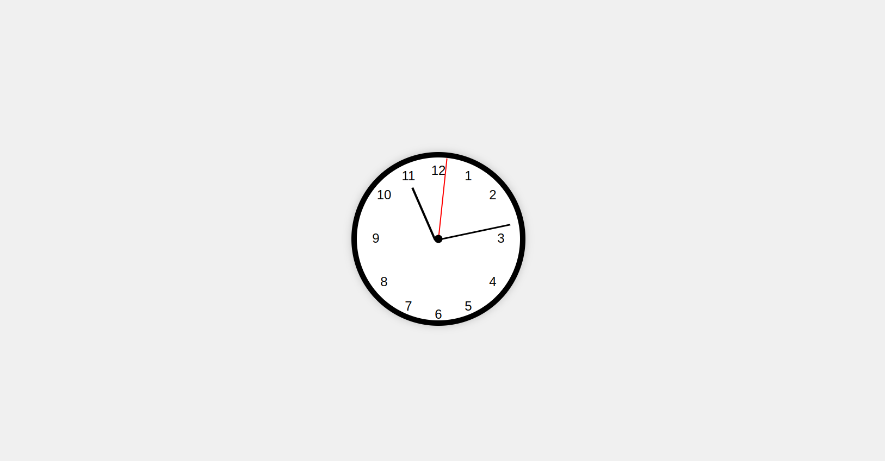

# Analog Wall Clock

A functional analog wall clock built using **HTML**, **CSS**, and **JavaScript**. This clock shows the current time with moving hour, minute, and second hands, styled to resemble a traditional wall clock.

## Demo

 

## Features

- Real-time display of current time
- Moving hour, minute, and second hands
- Styled to look like a classic analog clock
- Responsive and adaptable design

## Technologies Used

- **HTML**: Structure of the clock
- **CSS**: Styling and layout
- **JavaScript**: Functionality for real-time clock movement

## Installation

1. **Clone the repository**:

    ```bash
   https://github.com/Caleb-ne1/Classic-Analog-Clock.git
    ```

2. **Navigate to the project directory**:

    ```bash
    cd Classic-Analog-Clock
    ```

3. **Open `index.html` in your browser**:

    You can directly open `index.html` in your web browser or use a live server extension (like in VSCode).

## Usage

Once the project is opened in your browser, the clock will display the current time and update the hands in real-time. No additional setup is needed.


